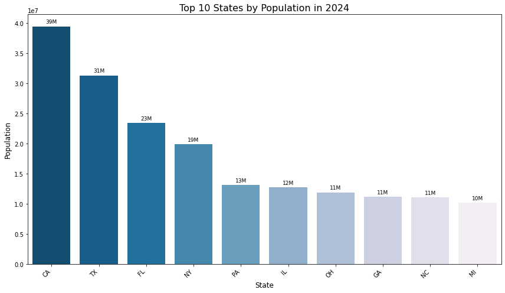
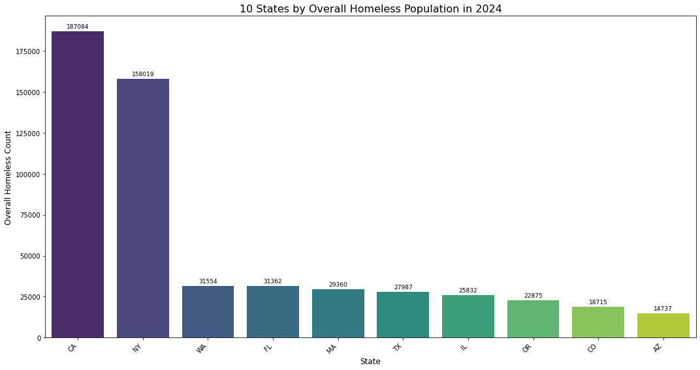
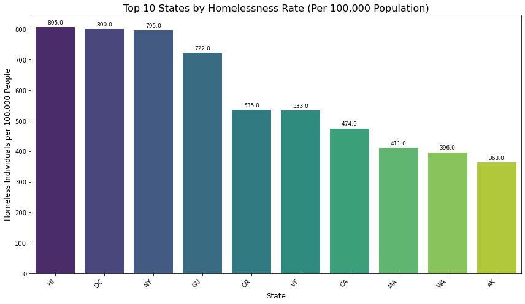
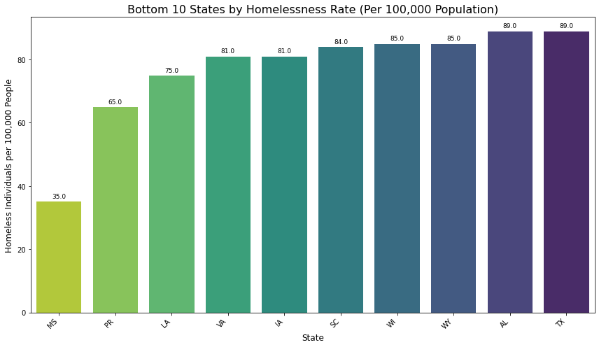
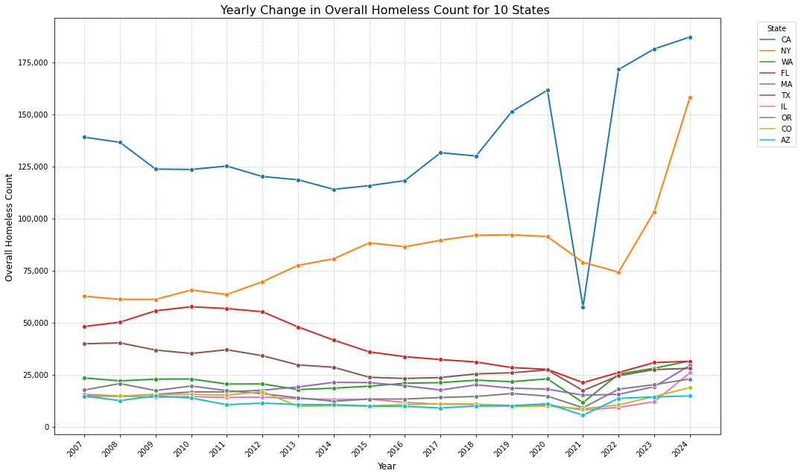
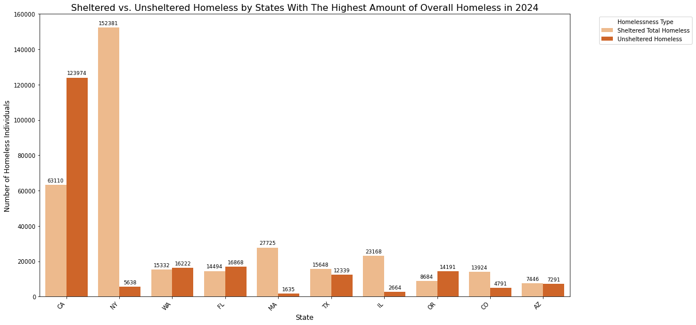

# US Homelessness Analysis: State-Level Trends and Population Correlation (2007-2024)

## 📋 Project Overview

This project analyzes homelessness trends across US states using official data from the US Department of Housing and Urban Development (HUD) and US Census Bureau population estimates. The analysis aims to provide insights into the distribution and scale of homelessness across different states, which can inform policy decisions and resource allocation for addressing homelessness.

### Key Findings
- Identification of states with highest absolute homeless populations
- Analysis of homelessness patterns across different states and territories
- Correlation between state population size and homeless population counts

## 📊 Dataset Description

### Primary Data Sources

#### 1. HUD Point-in-Time (PIT) Estimates (2007-2024)
- **Source**: US Department of Housing and Urban Development
- **URL**: [2024 AHAR Part 1 PIT Estimates](https://www.huduser.gov/portal/datasets/ahar/2024-ahar-part-1-pit-estimates-of-homelessness-in-the-us.html)
- **File**: 2007-2024-PIT-Counts-by-State.xlsb
- **Description**: Annual Point-in-Time counts of homeless individuals across all US states and territories
- **Coverage**: All 50 states plus DC and US territories
- **Time Period**: 2007-2024

#### 2. US Census Bureau Population Estimates (2024)
- **Source**: US Census Bureau
- **Description**: Latest available population estimates for all US states and territories
- **Year**: 2024
- **Coverage**: All 50 states, DC, and major US territories (Puerto Rico, Guam, Virgin Islands, Northern Mariana Islands, American Samoa)

#### 3. USA states GeoJson
- **Source**: Kaggle
- **URL**: https://www.kaggle.com/datasets/pompelmo/usa-states-geojson/data
- **Description**: GeoJson encoding for usa states, for map plots
- **Coverage**: All 50 states, DC, and major US territories (Puerto Rico, Guam, Virgin Islands, Northern Mariana Islands, American Samoa)


### Data Structure
- **Total Records**: 56 jurisdictions (50 states + DC + 5 territories)
- **Key Variables**:
  - `State`: Two-letter state/territory abbreviation
  - `Overall Homeless`: Total count of homeless individuals (2024 PIT count)
  - `Population 2024`: Total population estimate for 2024

## 🔍 Analysis Overview

### Current Analysis Completed

#### 1. Data Exploration and Cleaning
- Loaded and processed HUD XLSB file format
- Cleaned data to remove totals and non-state entries
- Filtered for valid numeric homeless population counts
- Merged homeless data with population estimates

#### 2. Top States Analysis
- **Visualization**: Bar chart of top 10 states by absolute homeless population
- **Key Insights**:
  - Identified states with highest homeless populations
  - Clear visualization of the disparity between states
  - Analysis excludes national totals for accurate state-level comparison

#### 3. Population Correlation Preparation
- Merged homeless population data with 2024 Census population estimates
- Created combined dataset for correlation analysis between state population size and homeless counts

### Methodology
- **Data Processing**: Pandas for data manipulation and cleaning
- **Visualization**: Matplotlib and Seaborn for chart creation
- **Statistical Analysis**: Descriptive statistics and data exploration

## 📈 Key Visualizations

1. **Top 10 States by Homeless Population (2024)**
2. **Top 10 States with The Highest Population**
3. **10 States with The Highest Ratio of Homeless per 100K Population**
4. **10 States with The Lowest Ratio of Homeless per 100K Population**
5. **Yearly Change in Overall Homeless Count for 10 States**
6. **Sheltered vs. Unsheltered Homeless by States With The Highest Amount of Overall Homeless in 2024**
   







## 🛠️ Technical Implementation

### Requirements
```python
pandas
matplotlib
seaborn
pyxlsb  # For reading Excel Binary files
```

### Project Structure
```
├── data/
│   ├── raw/
│      └── 2007-2024-PIT-Counts-by-State.xlsb
├── notebooks/
│   └── Homelessness_US_Analysis.ipynb
├── src/
│   └── analysis.py
├── visualizations/
│   └── US_States_Pop_2024.png
│   └── top_10_states_homeless_2024.png
│   └── Top10_Homelessness_Rate100K.png
│   └── Bottom10_Homelessness_Rate100K.png
│   └── yearly_trend.png
├── README.md

```

## 🎯 Research Applications

This analysis can be valuable for:
- **Policy Makers**: Understanding state-level homelessness distribution
- **Non-Profit Organizations**: Resource allocation and program planning
- **Researchers**: Baseline data for homelessness studies
- **Public Health Officials**: Population health planning
- **Urban Planners**: Housing and service planning

## 🔮 Future Analysis Opportunities

1. **Temporal Trends**: Analyze year-over-year changes (2007-2024)
2. **Per Capita Analysis**: Calculate homelessness rates per 1,000 population
3. **Regional Analysis**: Group states by geographic regions
4. **Demographic Breakdown**: Analyze by age, family status, and veteran status
5. **Correlation Studies**: Examine relationships with housing costs, unemployment, weather patterns
6. **Predictive Modeling**: Forecast future trends based on historical data

## 📊 Data Quality Notes

- All data sources are official government statistics
- PIT counts represent annual snapshots, typically conducted in January
- Population estimates are the most recent available from Census Bureau
- Some territories may have limited historical data availability

## 🤝 Contributing

This project welcomes contributions, particularly:
- Additional data sources (housing costs, economic indicators)
- Advanced statistical analysis
- Interactive visualizations
- Geographic mapping capabilities

## 📄 License

This project uses publicly available government data. Please cite original data sources when using this analysis.

## 📞 Contact

- Linkedin: linkedin.com/in/azhar-kudaibergen/
- Email: kuda.azhar@gmail.com
---

**Data Sources**:
- US Department of Housing and Urban Development - Annual Homeless Assessment Report
- US Census Bureau - Population Estimates Program
